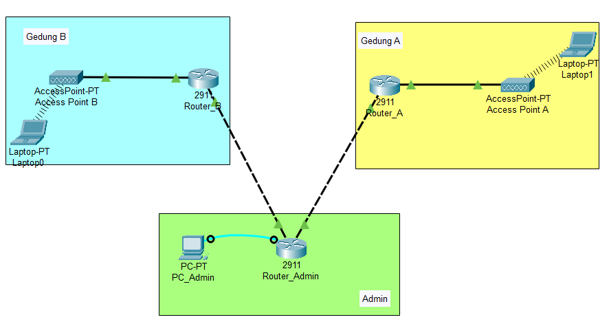

# Simulasi Jaringan Multi-Gedung dengan Cisco Packet Tracer

Ini adalah proyek simulasi jaringan yang dibangun menggunakan Cisco Packet Tracer versi 8.2.1. Proyek ini mendemonstrasikan pembuatan topologi jaringan Hub-and-Spoke yang menghubungkan satu kantor pusat (Admin) dengan dua gedung cabang (Gedung A & Gedung B).

---

## Fitur Utama

Jaringan ini memiliki beberapa fitur utama yang telah dikonfigurasi, antara lain:

* **Topologi Hub-and-Spoke:** Desain jaringan terpusat untuk kemudahan manajemen dan kontrol.
* **Static Routing:** Konfigurasi rute manual untuk memastikan semua jaringan dapat berkomunikasi. Termasuk penggunaan *Default Route* di router cabang.
* **DHCP Server:** Setiap gedung memiliki DHCP Server sendiri (dikonfigurasi di router) untuk memberikan alamat IP secara otomatis kepada klien.
* **Wireless LAN (WLAN):** Setiap gedung dilengkapi dengan Access Point yang menyebarkan sinyal Wi-Fi dengan keamanan WPA2-PSK.
* **Kontrol Akses (ACL):** Demonstrasi pemblokiran lalu lintas data, baik untuk seluruh segmen jaringan (satu gedung) maupun untuk satu pengguna spesifik berdasarkan alamat IP.
* **Simulasi Realistis:** Menggunakan PC Admin dengan koneksi konsol untuk konfigurasi awal, mensimulasikan praktik kerja di dunia nyata.

---

## Spesifikasi Perangkat & Topologi Fisik

Berikut adalah detail perangkat keras, jenis kabel, dan port yang digunakan dalam simulasi ini.

### Daftar Perangkat Keras
* **Router Cisco 2911**: 3 buah (`Router_Admin`, `Router_A`, `Router_B`)
* **Access Point-PT**: 2 buah (`AccessPoint_A`, `AccessPoint_B`)
* **PC-PT**: 1 buah (`PC_Admin`)
* **Laptop-PT**: 1 buah (Sebagai klien untuk pengujian)

### Detail Pengkabelan & Port

| Perangkat Sumber | Port Sumber         | Jenis Kabel           | Perangkat Tujuan  | Port Tujuan         | Keterangan          |
| :--------------- | :------------------ | :-------------------- | :---------------- | :------------------ | :------------------ |
| `PC_Admin`       | RS 232              | **Console (Biru)**    | `Router_Admin`    | Console             | Manajemen Awal      |
| `Router_Admin`   | GigabitEthernet0/1  | **Cross-Over**        | `Router_A`        | GigabitEthernet0/1  | Koneksi ke Gedung A |
| `Router_Admin`   | GigabitEthernet0/2  | **Cross-Over**        | `Router_B`        | GigabitEthernet0/2  | Koneksi ke Gedung B |
| `Router_A`       | GigabitEthernet0/0  | **Straight-Through**  | `AccessPoint_A`   | Port 0              | Jaringan Wi-Fi A    |
| `Router_B`       | GigabitEthernet0/0  | **Straight-Through**  | `AccessPoint_B`   | Port 0              | Jaringan Wi-Fi B    |

---

## Detail Konfigurasi

* **Skema IP Address:**
    * Jaringan Admin <=> Gedung A: `192.168.10.0/24`
    * Jaringan Admin <=> Gedung B: `192.168.20.0/24`
    * Jaringan Internal Gedung A (WLAN): `10.10.10.0/24`
    * Jaringan Internal Gedung B (WLAN): `20.20.20.0/24`
* **Kredensial Wi-Fi:**
    * **WIFI_GEDUNG_A:** `gedungA123`
    * **WIFI_GEDUNG_B:** `gedungB123`

---

## Cara Menggunakan

1.  Download dan install [Cisco Packet Tracer](https://www.netacad.com/courses/packet-tracer) (versi 8.2.1 atau yang lebih baru).
2.  Clone repository ini atau download file `.pkt` secara langsung.
3.  Buka file `.pkt` tersebut menggunakan Packet Tracer.
4.  Jalankan skenario simulasi yang dijelaskan di bawah untuk menguji fungsionalitas jaringan.

---

## Skenario Simulasi

* **Koneksi Klien:** Hubungkan laptop ke salah satu SSID, laptop akan mendapatkan alamat IP secara otomatis dari DHCP. Lakukan tes `ping` untuk memverifikasi konektivitas.
* **Simulasi Roaming:** Pindahkan laptop secara fisik dari jangkauan Gedung A ke Gedung B, lalu sambungkan ke jaringan Wi-Fi Gedung B untuk melihat perubahan alamat IP.
* **Simulasi Kontrol Admin:** Dari `PC_Admin`, akses `Router_Admin` melalui Terminal untuk mencoba skenario mematikan (`shutdown`) salah satu interface atau menerapkan ACL untuk memblokir klien.

Dibuat oleh **Eros Alfedo Hermanto** - 2025.